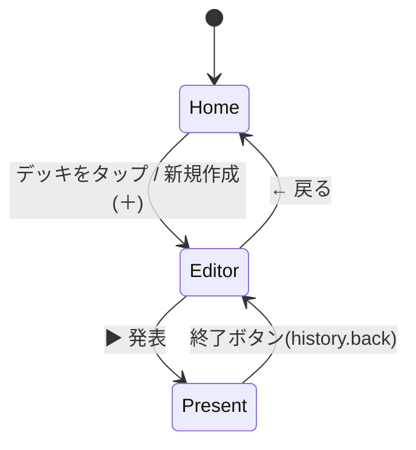

# 画面遷移・ワイヤーフレーム概要

画面はReactコンポーネント（`src/screens/`）3つのみで構成され、ルーターライブラリは使わず`history.pushState`ベースの`useScreen`フック（`src/hooks/useScreen.ts`）で状態を管理する（`ScreenState`型: `home` / `editor` / `present`）。

## 画面遷移図



## Home画面（`src/screens/HomeScreen.tsx`）

- ヘッダー: タイトル「どこでもプレゼン」／「JSON読み込み」ボタン（`input[type=file]`でJSONインポート）。
- デッキ一覧（`home__list`）: 各デッキをカード表示（サムネイル=先頭スライドの実レイアウト縮小表示、タイトル、更新日時）。空の場合は案内文。
  - タップ: Editor画面へ遷移。
  - 長押し（`useLongPress`）: ボトムシート（複製／JSON書き出し／PDF書き出し／削除）を開く。
- 右下FAB（＋）: 新規デッキ作成→即Editor画面へ遷移。

```
┌─────────────────────────────┐
│ どこでもプレゼン   [JSON読み込み]│
├─────────────────────────────┤
│ [縮小プレビュー] タイトル      │
│                 更新: 日時    │
│ [縮小プレビュー] タイトル      │
│                 更新: 日時    │
│                              │
│                         (+) │ ← FAB
└─────────────────────────────┘
```

## Editor画面（`src/screens/EditorScreen.tsx`）

上から縦に: ヘッダー→ライブプレビュー(42%)→（要約Undoバー・任意）→複数行テキスト入力(38%)→（発表メモ・任意）→アイコンツールバー→フィルムストリップ。

- ヘッダー: 戻るボタン、デッキタイトル編集用input。
- プレビュー（`editor__preview`）: `SlideView`（DOM絶対配置レンダラ）でライブレイアウトを表示。左右スワイプでスライド切替。レイアウト警告（文字量過多等）があればバッジをタップしてボトムシートを開く（警告メッセージ・読みやすさスコア・ヒント・「要約して縮める」ボタン）。
- テキストエリア: 1行目=タイトル、`・-*`で箇条書き、空行で段落区切り。選択範囲に対してマーカー(yellow/pink/blue)・強調を適用可能。
- ツールバー: 画像追加、（画像がある場合のみ）画像の説明編集、マーカー3色、強調、レイアウト切替（ボトムシートで6候補をカルーセルプレビュー）、メモ表示切替、▶発表、PNG保存。
- フィルムストリップ: 各スライドの縮小プレビュー。タップで切替、長押し+ドラッグで並べ替え、上スワイプで削除、＋で新規スライド追加。

```
┌─────────────────────────────┐
│ ←   [デッキタイトル入力]        │
├─────────────────────────────┤
│                              │
│      ライブプレビュー(16:9)     │
│  ⚠ 警告バッジ(タップでシート)    │
├─────────────────────────────┤
│ [複数行テキスト入力エリア]        │
├─────────────────────────────┤
│ 画像 マーカー×3 強調 レイアウト…  │
│ メモ ▶発表 PNG保存             │
├─────────────────────────────┤
│ [縮小1][縮小2][縮小3]... [+]  │ ← フィルムストリップ
└─────────────────────────────┘
```

## Present画面（`src/screens/PresentScreen.tsx`）

- フルスクリーン・黒背景に16:9のステージを中央配置（`present__stage`、`aspect-ratio: 16/9`、portrait時はCSSで幅を`100vh`基準に切替）。
- `@capacitor/screen-orientation`で横向き固定を試み、失敗時（Web/非対応環境）は上記CSSフォールバックに任せる。
- 左右スワイプでページ送り、ダブルタップでオーバーレイUI（ページ番号／経過時間／終了ボタン、発表メモ）の表示・非表示を切替。

```
┌─────────────────────────────┐
│ 1/5              00:32   終了│ ← オーバーレイ(ダブルタップで隠せる)
│                              │
│        スライド本体(16:9)      │
│                              │
│ 発表メモ                      │
└─────────────────────────────┘
```
